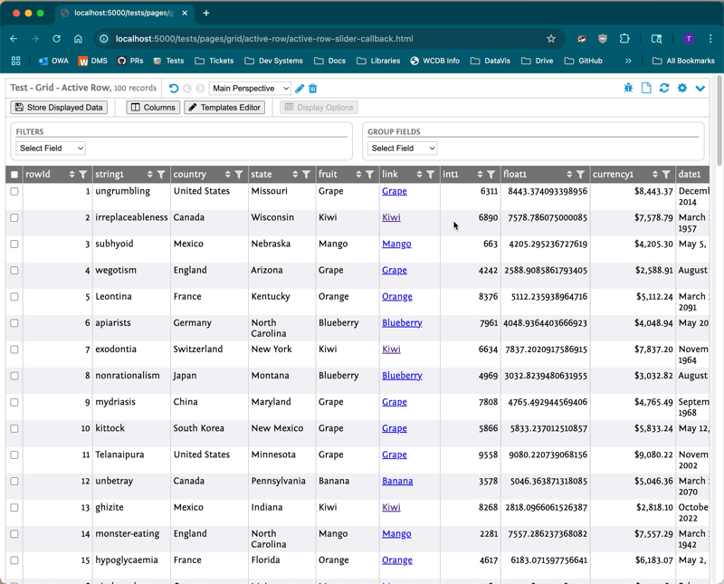

# Active Row

## Enabling the Feature

The active row feature is enabled by the developer when the grid is created. The feature flag is called `activeRow`.

## Behavior

- Clicking a non-interactive element, such as text within a table cell, marks that row as “active.” The active row is highlighted.
- While there is an active row, pressing the `j` and `k` keys while not inside an interactive element (e.g. a text input box) moves the active row down and up, respectively. This movement wraps (e.g. when the first row is active, pressing `k` makes the last row active). If the active row is off-screen, the table scrolls to show it.
- While the slider is open, pressing the `escape` key closes it.



## Using the Slider

The “slider” is a window that slides in from the right hand side of the viewport. If you don’t also specify a callback, the slider automatically shows information on all the columns in the grid. Which is pretty basic and probably not what you want.

## Using the Slider with a Callback

You can use the slider with a callback to set the content of the slider to whatever you want. If you are going to load data from some other resource, I recommend sticking some kind of loading icon in there. The callback is invoked synchronously, and includes the following properties in its sole argument:

- `rowId` — The ID of the active row. Probably not super useful, unless you’re keeping track of what rows have been marked active.
- `rowData` — An object of internal data values of the active row. As seen in other callbacks, the keys are field names, and the values are cells.
- `colConfig` — An `OrdMap` instance of the current column configuration of the grid. Useful for stuff like extracting the translated display name for columns, or whether a column is treated as HTML.
- `slider` — The slider instance. Call methods like `setHeader()` and `setBody()` to control the slider. You could also use the `hide()` method from a button to hide the slider and clear the active row.
- `tableRow` — The `<TR>` element of the active row. You could use this to apply a class to the row, or even invoke the behavior of some other button (like an operation) inside it.
- `tableRenderer` — The `GridTablePlain` instance for the grid. An example use for this is including a button in the slider that advances the active row by calling `tableRenderer.activeRowNext()`.

```
{
  table: {
    features: {
      activeRow: true
    },
    activeRow: {
      slider: true,
      callback: ({rowId, rowData, slider}) => {
        slider.setHeader('...');
        slider.setBody('...');
      }
    }
  }
}
```

## Using a Callback without a Slider

You can use the callback functionality without a slider. It’s up to you to do something else with the active row’s data. All other properties of the callback’s argument are present as described above.