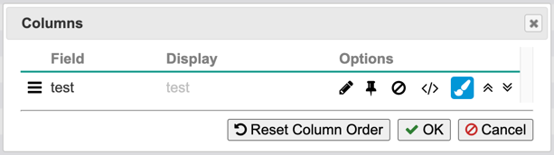
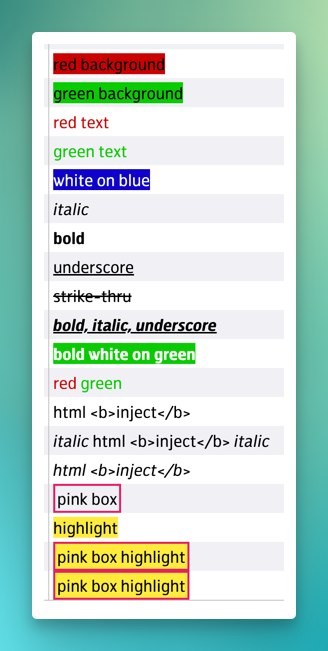

# Table Grid Renderer

A grid table is a representation of the actual data table that appears
when rendering a grid, both in normal and in pivot mode. The grid table
creates the user interface for interactive sorting and filtering. The
grid table gets its data directly from the \_<span role="doc">data
view\<data\_view\></span>.

There are two ways that grid tables are used within the wcgraph library:

  - Under the control of a WCGRID instance. This is how it works when
    the grid is in non-pivot mode. The grid table has full features
    enabled (it controls sorting, filtering, and paging within the
    view).
  - Under the control of a PivotControl instance. This is how it works
    when the grid is in pivot mode. The grid table has filtering
    disabled (because the pivot control handles filtering).
      - The data view provides the grid table with pivotted data. This
        means that the rows and columns returned by `DataView#getData()`
        and the type information provided by `DataView.getTypeInfo()`
        reflect the fact that we are looking at a transformation of the
        data provided by the data source.
      - The pivot control sets the grouping, pivotting, and filtering of
        the view.
      - The grid table still controls sorting and paging.

## Formatting

Data values that contain embedded formatting strings can be rendered when the column configuration allows it. The formatting strings have the following format:

```
{{dv.fmt:<SPECS>}}text{{/}}
```

where `<SPECS>` is a comma-separated list of format specifiers:

- `bg=HHHHHH` sets the background color to the RGB hex color
- `fg=HHHHHH` sets the foreground color to the RGB hex color
- `ts=X` sets the text style as specified, with any of the following letters supported:
  - `b` for bold
  - `i` for italic
  - `s` for strike-through
  - `u` for underline
- `cls=C` sets CSS class(es) for the HTML element; multiple classes can be separated by spaces, or use several `cls` formatters.

!!! info
	Formatting does not use HTML in the data value. Any HTML in the data value will still be subject to the separate `allowHtml` property. This makes formatting strings a safe way to change the display of data without worrying about HTML injection.

!!! warning
	Because formatting strings are part of the value, they affect the ordering of data when grouping, sorting, and computing aggregate functions. They will also appear in the dropdown when filtering, and will cause numeric values to be treated as strings. These limitations may be addressed in future updates.

### Column Configuration

The property to allow formatting is `allowFormatting` and it can be accessed in the user interface via the “Columns” dialog, where it is represented by the paintbrush icon.



### Examples

```
{{dv.fmt:bg=CC0000}}red background{{/}}
{{dv.fmt:bg=00CC00}}green background{{/}}
{{dv.fmt:fg=CC0000}}red text{{/}}
{{dv.fmt:fg=00CC00}}green text{{/}}
{{dv.fmt:bg=0000CC,fg=FFFFFF}}white on blue{{/}}
{{dv.fmt:ts=i}}italic{{/}}
{{dv.fmt:ts=b}}bold{{/}}
{{dv.fmt:ts=u}}underscore{{/}}
{{dv.fmt:ts=s}}strike-thru{{/}}
{{dv.fmt:ts=biu}}bold, italic, underscore{{/}}
{{dv.fmt:bg=00CC00,fg=FFFFFF,ts=b}}bold white on green{{/}}
{{dv.fmt:fg=CC0000}}red{{/}} {{dv.fmt:fg=00CC00}}green{{/}}
html <b>inject</b>
{{dv.fmt:ts=i}}italic{{/}} html <b>inject</b> {{dv.fmt:ts=i}}italic{{/}}
{{dv.fmt:ts=i}}html <b>inject</b>{{/}}
{{dv.fmt:cls=pink-box}}pink box{{/}}
{{dv.fmt:cls=highlight}}highlight{{/}}
{{dv.fmt:cls=pink-box highlight}}pink box highlight{{/}}
{{dv.fmt:cls=pink-box,cls=highlight}}pink box highlight{{/}}
```


